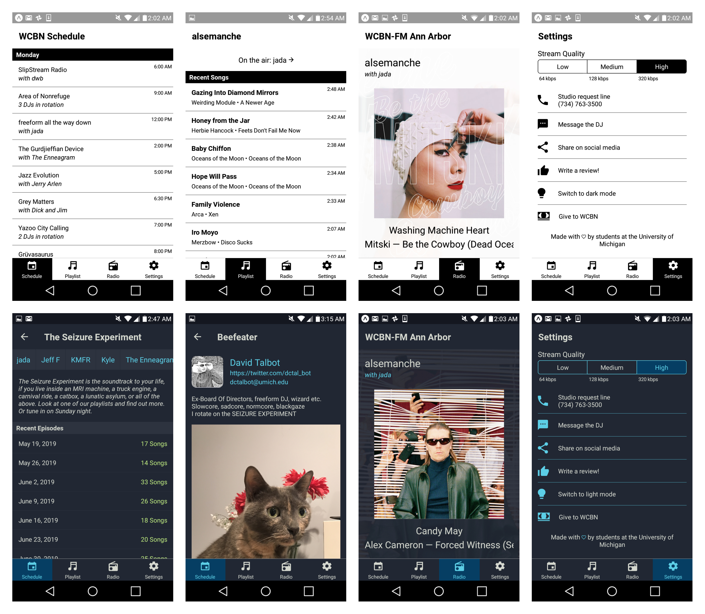

# React-Native WCBN App for Android and iOS

# Demo

[View with the Expo app](https://expo.io/@dctalbot/wcbn-app)

# Things you'll need

- [yarn](https://classic.yarnpkg.com/lang/en/)
- [Expo Client](https://apps.apple.com/us/app/expo-client/id982107779) OR [Xcode](https://apps.apple.com/us/app/xcode/id497799835?mt=12) device simulator OR [Android Studio](https://developer.android.com/studio) AVD emulator

# Getting started

    cd player-react-native
    yarn
    yarn start

# How to Update

Expo has quarterly releases. Ideally, someone upgrades the app about once per year.

1. `yarn` to make sure dependencies are good
1. `git checkout -b sdk46` to create a branch named after the target version e.g. SDK 46
1. `yarn expo upgrade` ... Would you like to update to the latest version, 46.0.0? … `yes`
1. Find the release notes on https://blog.expo.dev/. You need to look at remedy all Breaking Changes between the current version and your target upgrade version. So if you're upgrading from SDK 44 to 46, you need to review Breaking Changes for SDK 45 and SDK 46 and make sure all are accounted for.
1. Fix all breaking changes.
1. Go to the How to Deploy

# How to Deploy

1. Bump `app.json` `version` and `expo.android.versionCode`
2. Create pull request (make sure github actions checks pass)
3. `yarn expo build:android --type app-bundle`
4. Download from turtle
5. Upload to Google Play console
6. Wait for Google to approve
7. Merge PR (github actions will publish to expo)
