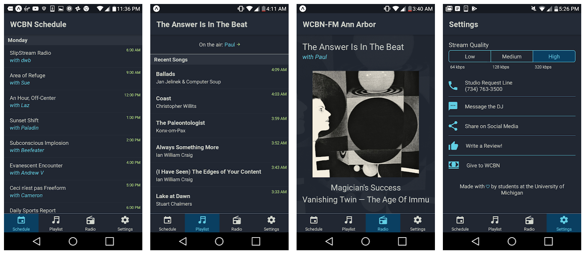

# React-Native WCBN App for Android and iOS

# Demo

[View with the Expo app](https://expo.io/@dctalbot/wcbn-app)

# Things you'll need

- yarn
- Expo app / account
- iOS / Android Studio Emulators (optional)

# Some Light Reading

- https://facebook.github.io/react-native/
- https://docs.expo.io/versions/latest/
- https://reactnavigation.org/docs/en/getting-started.html
- https://facebook.github.io/flux/

# Getting started

Fork this repo

    git clone https://github.com/<username>/player-react-native.git
    cd player-react-native
    yarn
    yarn start

# GitHub Actions

I've also hooked this up to publish with the brand-new GitHub actions workflow (thanks @bycedric !). Check out the fork @dctalbot if you're curious how that works.

contact: dctalbot@umich.edu
